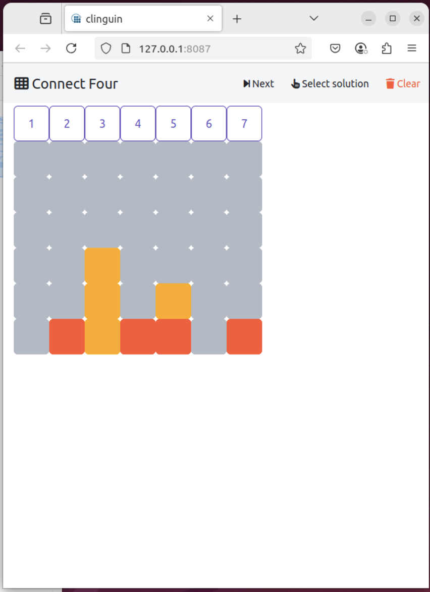

# Visualisation with Clinguin
Clinguin is a recent tool available from the Potassco program suite. Its purpose is interactive enduser-friendly visualisation for answer set programming. This is my first try in using it for Connect Four.

Clinguin needs to be installed on your system.

Usage: $ clinguin client-server --domain-files connect4/{enc.lp,ins.lp} --ui-files connect4/ui.lp

